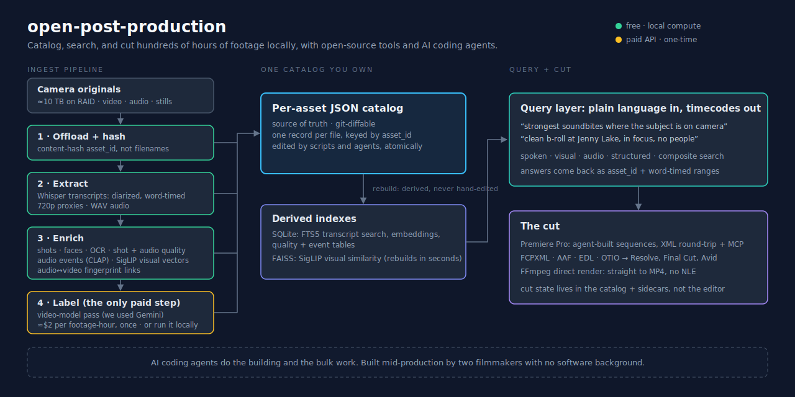

# open-post-production

*Catalog, search, and cut hundreds of hours of footage on hardware you own: a post-production stack built from open-source tools, operated with AI coding agents.*

Ask plain-language questions of a 400-hour footage corpus (*"strongest soundbites where the subject is on camera," "clean b-roll at Jenny Lake, in focus, no people"*) and get exact, timecoded answers back. Then have a coding agent assemble the result into a sequence and round-trip it into Premiere Pro as XML, retarget to Resolve, Final Cut, or Avid via FCPXML, AAF, EDL, or OTIO, or render straight to MP4 with FFmpeg and skip the NLE entirely. Everything runs locally and subscription-free; the only paid step is an optional one-time video-labeling pass (≈$2 per hour of footage).



## What this is

A media asset management (MAM) system built from open-source tools that you run on your own hardware and own end to end. It catalogs every clip, audio file, and still, transcribes and diarizes the dialogue, and adds searchable layers on top (visual and face search, shot detection, captions, audio events, quality flags), so you can ask plain-language questions of hundreds of hours of footage and get exact answers back.

On top of that catalog, you build whatever the project needs, using AI coding agents. We wrote scripts that move cuts in and out of Premiere as XML, so an agent can create assembly-cut sequences against any type of editor prompt. On our end, a data-driven graphics pipeline is up next, then storytelling feedback that reasons over the cut (already in process in [`editor/story`](editor/story)). Everything starts with one catalog you control.

It replaces most of the post-production subscription stack with tools you run once and keep. What's left is a frontier AI model and a non-linear editor (NLE), or whatever other tools you need for your hands-on editing (e.g., smaller projects may choose direct-to-MP4 using FFmpeg, which you can read more about in [`editor/xml exports`](editor/xml%20exports)).

**This is a blueprint with working code, not an installable app.** It's the actual stack we cut a feature documentary on: the scripts, the catalog schema, the derived indexes, sample assets, and the reasoning behind every choice, published so other small teams can adapt it with their own coding agent. There's no installer and no hosted service. Clone it, try the sample corpus below, then rebuild it around your own footage. The workspace holds a **dataset** (source-of-truth JSON catalog), **indexes** (derived SQLite + FAISS), **derivative media** (proxies and extracts), and **editor** (cut geometry, sidecars, queries). Coding agents onboard via [`AGENTS.md`](AGENTS.md) (Claude-flavored instance: [`CLAUDE.md`](CLAUDE.md)); open work is tracked in `*_GAPS.md` files.

## Why this exists

This repo is by Alex Rienzie and Connor Burkesmith, the team behind **Fior Productions**. Alex is an ex-J.P. Morgan banker and Harvard Law grad, and Connor is an ex-civil engineer turned action-sports filmmaker; neither of us have much coding experience. Our friendship started in the mountains, going from near-zero ski mountaineering experience to Grand Teton's Ford-Stettner Route (chronicled on [Grizzlies & Avalanches](https://www.grizzliesandavalanches.com/)), then carried through a few legal battles, [*Rienzie v. Haaland*](https://www.fire.org/cases/rienzie-v-haaland-national-parks-belong-american-public-we-should-be-allowed-film-there) and [*United States v. Sunseri*](https://www.vanityfair.com/news/story/trail-runner-presidential-pardon), and now documentary filmmaking.

Our current project, [*Racing Grand Teton*](https://racinggrandteton.com/), has far more footage than we'll ever be able to fully wrap our heads around (225 hours of video and another 175 of audio), and like most docs, the story evolves in the edit. Partway through post-production, we began looking for software to more efficiently and effectively manage that quantum of media. We tried some AI post-production tools and read up on the rest.

Through trial and error, we learned that the expensive-sounding parts of many of those commercial tools (transcription, visual and face search, shot logging, semantic retrieval) are largely available through open-source software that can run on your local machine for free. For the first time, those open-source tools are accessible to small, non-technical teams through AI coding agents.

So, we created a working corpus with proxies, audio, transcripts, and a searchable index of all media metadata and adjacent data (press coverage, court filings, social media comments, etc.) on a 2 TB SSD that runs from a regular laptop. Nothing gets uploaded (beyond what we choose to feed into API calls for LLM processing), there's no subscription, and we own every byte of the metadata. As we continue through post-production, that asset management layer will serve as the foundation for automated graphics workstreams, subtitles, sound-design spotting and color-grade prep (stay tuned for additions to this repo).

We built this stack for feature documentary post, but the overall approach fits anything with more footage than final cut: commercial work, a photographer's back catalog, scripted projects, etc. The folder structure, labels and some tooling change, the methods should be consistent.

Almost everything here (the catalog schema, the ingest pipeline, the enrichment layers, this documentation) was built with **Claude Code** and **Cursor** agents in the loop, plus a lot of Googling and tips from friends in post. You should pressure-test everything, as the space is moving fast, our choices (models, libraries, encoders, what's worth indexing) will be partly stale within months, and different hardware will point to different answers. Where we know an assumption will age out, we flag it in [`DESIGN.md`](DESIGN.md) under "Decisions we know will need revisiting." If you spot something we got wrong, open a pull request or fork it, and feel free to reach out to talk it through.

We jumped into this redesign mid-post, so some of the tooling here compensates for organizational choices we'd make differently from day one. Getting filename, folder, camera-id, and slate discipline at offload saves a lot of downstream work. See [`DESIGN.md` § "Upstream media-organization disciplines (retrospective)"](DESIGN.md#upstream-media-organization-disciplines-retrospective) before the rest.

This repo is only a starting point. Local hardware is about to take a big jump, so a future version could layer on much, much more than we built. We struggled to figure out these tools, and wanted to share our learnings for use by other small, bootstrapped teams.

## Try it on the sample corpus

The repo ships a sliced sample corpus: a handful of real assets from the film, with proxies, diarized transcripts, and prebuilt embedding stores, so the data model is tangible before you ingest anything of your own. This part needs **Python 3.10+ and nothing else** (the catalog build and keyword search are stdlib-only):

```powershell
git clone https://github.com/alexrienzie/open-post-production.git
cd open-post-production

# 1 · Build the join surface (indexes/editorial_catalog.sqlite) from the sample catalog
python "dataset/_scripts/build_editor_db.py"

# 2 · Keyword-search the sample transcripts (word-timed FTS5)
python "editor/queries/retrieval.py" search-transcript --query "house"
```

Hits come back asset-addressed and word-timed:

```text
 1. asset_id=7fdd56a9… t=13.1-14.1s "- You just sold your house."
```

From there, [`editor/queries/queries_README.md`](editor/queries/queries_README.md) maps every search modality (spoken, visual, audio, structured, composite; semantic and visual-similarity search need the ML extras below). To run the full pipeline on your own footage, follow [`INGEST.md`](INGEST.md).

### Requirements (full pipeline)

| Layer | Needs |
| --- | --- |
| Catalog + SQL/FTS queries | Python 3.10+ (stdlib `sqlite3`), any OS |
| Proxies / WAV extraction | FFmpeg |
| Transcription + diarization | Whisper, run locally; a GPU helps a lot |
| Visual + semantic search | PyTorch, SigLIP, sentence-transformers, FAISS |
| Video labeling (optional, the one paid step) | API key for a video-capable model (we used Gemini); ≈$2 per footage-hour, once, or run a local model |
| The cut | Any NLE via XML / FCPXML / AAF / EDL / OTIO (ours: Premiere Pro on Windows), or no NLE at all (FFmpeg render) |

The heavy phases (transcribe, encode, vision) want a capable machine; catalog work and queries run on anything. Per-layer alternatives and runtimes by machine class are in [`DESIGN.md`](DESIGN.md#inference-cost-surface-external-llm-vs-local-inference-vs-no-inference).

## How it works

The full runbook (what to run, in what order) is in [`INGEST.md`](INGEST.md), and the reasoning behind each choice is in [`DESIGN.md`](DESIGN.md). The short version:

**The pipeline.** Cheap, deterministic work first; the expensive model pass last. Offload and hash every file (each asset gets a content-hash `asset_id` rather than a filename, since cameras reuse names across shoots), extract audio and transcribe with Whisper, and make 720p proxies. Then the local enrichment layers: shot boundaries, faces, on-screen text (OCR), per-shot and audio quality, audio-event tags, audio-to-video fingerprint links, and a vision encoder (SigLIP) for visual-similarity vectors. Last, the one expensive step: a video-model pass (we use Gemini) for semantic labels. With the cheap layers already in hand you can target that pass well, sampling a few frames per shot and refining the prompt rather than running it blind. Each result lands in the catalog or its own index. Whatever the step, smoke-test on a few assets before any bulk run. (We ran the expensive pass earlier than this; the cost-ordering and what we would change is in [`DESIGN.md`](DESIGN.md).)

**The data model.** The per-asset JSON catalog under `dataset/` is the source of truth (git-diffable, one record per file, editable by many scripts at once). Everything you query is derived from it: the SQLite indexes and embedding stores under `indexes/` rebuild from the catalog in under half an hour. You never hand-edit an index; you change the catalog and rebuild. Writes are atomic, and each schema carries a version so migrations stay explicit.

**Enrichment is asset-type-aware.** Not every layer earns its compute on every clip. An interview wants transcripts and faces; b-roll wants visual and caption signal; a timelapse wants almost nothing. The triage table is in [`INGEST.md`](INGEST.md#asset-type-aware-enrichment-depth).

**It is portable.** Nothing is tied to an operating system or a non-linear editor (NLE). The heavy phases (transcribe, encode, vision) want a capable machine; catalog work and editing run on anything. Because the cut lives in the catalog and sidecars, you can round-trip it to Premiere as XML, retarget to Resolve, Final Cut, or Avid via FCPXML, AAF, or OTIO, or render straight to MP4 with FFmpeg and skip the editor. Per-layer alternatives (transcription engines, encoders, vision models) are in [`DESIGN.md`](DESIGN.md#portability-what-generalizes-vs-whats-our-setup).

**What it costs to run.** Almost every phase is free local compute. The one external call is the video-labeling pass, about $2 per hour of footage as a one-time pass, and you can do that locally too. The full breakdown, with runtimes by machine class, is in [`DESIGN.md`](DESIGN.md#inference-cost-surface-external-llm-vs-local-inference-vs-no-inference).

**Why build it rather than buy it.** The perception layer (transcription, visual and face search, shot logging) is open-source you run for free, and an AI coding agent is what makes it reachable without a dev team. Because you own the catalog, each new tool you hang off it (graphics, subtitles, sound spotting, grade prep) is a small build instead of another subscription. The fuller comparison is in [`DESIGN.md`](DESIGN.md#why-this-instead-of-a-product).

## Tree at a glance

```text
open-post-production/
├── dataset/                Canonical JSON - write here; see dataset_README.md
├── indexes/                Derived SQLite + FAISS - read here; see indexes_README.md
├── derivative media/       Proxies + extracts (sample set in this repo)
│   ├── sample/             sample proxies (plain camera filenames)
│   └── _index/             asset_map.json - asset_id → relative_path
├── editor/                 Cut + sidecars + queries - see editor_README.md
│   ├── premiere projects/
│   ├── xml exports/        canonical cut geometry (ours: xmeml v4)
│   ├── story/              Act sidecars, beat views, refresh scripts
│   └── queries/            editorial search over the indexes
├── premiere mcp/           Driving Premiere Pro from an agent over MCP (notes + patches)
├── _scripts/               Workspace-level utilities (mirroring, backups)
├── AGENTS.md               Portable agent policy - coding agents read this first
├── INGEST.md               Runbook: what to run when new content lands
├── DESIGN.md               Rationale, alternatives, costs, assumption decay
└── README.md               This file (workspace entry point)
```

**Derivative media note:** Catalog JSON and some xmeml pathurls may still use the legacy tilde form `~/derivative media/proxy videos/<asset_id>.mp4`. Resolve any proxy path via `derivative media/_index/asset_map.json` (in this repo the samples live under `derivative media/sample/`); in production, proxies mirror the RAID's shoot-folder layout.

## Storage architecture

*Racing Grand Teton* is ~400 hours of catalog media: 225 hours of video and 175 of audio, across 5K+ video clips, 400+ audio-only files, and 1K+ stills; overall ~10 TB of camera originals and then the proxies and extracts derived from them.

| Tier | Hardware | Holds | Why |
| --- | --- | --- | --- |
| **Master originals** | A multi-bay RAID (~16 TB usable over Thunderbolt is typical) | Every camera original under one project root (e.g. `<RAID>/<project>/`) | RAID redundancy on big spinning disks. Single source of truth for re-ingest, re-hash, and any pixel-perfect operation. |
| **Cold backups** | 3+ portable SSDs of varying sizes | Per-shoot mirrors of critical days | Disaster recovery: survives a RAID failure or theft. Not connected day-to-day. |
| **Editor / portable** | A 2 TB exFAT SSD (cross-platform) | The workspace (this repo's root): catalog JSON, indexes, **all proxies + WAVs + transcripts**, editor projects | Designed as the editor's "go bag": everything Premiere or the query layer needs is on one drive. Proxies fit (~360 GB) because they're 720p H.264. Originals don't, and don't need to. |

Three consequences to know before you change anything:

- **Hashing and tree-copy require the master.** Stage 1 (offload + index) reads camera originals, so run it on a machine with the master originals mounted. Everything downstream (transcription, proxies, model passes, enrichment) reads from `derivative media/` on the workspace SSD.
- **Mirror new content to a backup SSD before ingest.** The extraction runners (proxies, WAVs, transcripts) read sources via the backup-SSD tree, not the RAID directly. New folders that haven't been copied to at least one backup SSD will be silently skipped by `verify_ssd_match.py` and the proxy/WAV runners. RAID is the master; the backup SSDs are the working mirrors the extraction stage reads from.
- **The workspace SSD is exFAT.** It crosses macOS↔Windows freely. The cost is no native SQLite WAL safety (see "Conventions" below) and macOS leaves `._*` AppleDouble sidecars on writes; the pipeline accommodates both.

The whole workspace lives on that one portable SSD, which moves between the inference machine and the editing machine.

## Working with the workspace (agents and tooling)

No agent is required. The pipeline is plain Python plus a few `.cmd` wrappers, and everything runs directly. Agents are a productivity layer, not a dependency. They are also what makes the stack reachable without a dev team, so the workspace is built to onboard them: [`AGENTS.md`](AGENTS.md) holds the portable, model-agnostic agent policy (standing rules, read order, session hygiene), and [`CLAUDE.md`](CLAUDE.md) is its Claude-flavored instance.

One operational caveat: agents that reach the workspace through a **sandboxed mount** (bindfs / virtiofs / FUSE-class, e.g. desktop-app sandbox modes) can silently truncate larger writes and stall large file copies. Agents with native filesystem access (CLI agents, IDE-integrated agents, direct execution) are unaffected, and reads are safe in every mode. The full access-mode table and the safe-write workaround live in [`AGENTS.md` § Workspace access modes and write safety](AGENTS.md#workspace-access-modes-and-write-safety).

## Where to read next

| If you need… | Open |
| --- | --- |
| **What to do when new content arrives** (cards → catalog → indexes) | [`INGEST.md`](INGEST.md) |
| **Why we built it this way** (rationale, alternatives, assumption decay) | [`DESIGN.md`](DESIGN.md) |
| Catalog structure, rebuild commands | [`dataset/dataset_README.md`](dataset/dataset_README.md) |
| Field-level schema | [`dataset/dataset_SCHEMA.md`](dataset/dataset_SCHEMA.md) |
| Dataset open gaps | [`dataset/dataset_GAPS.md`](dataset/dataset_GAPS.md) |
| **Portable agent policy** (in-session vs API models; field naming; session hygiene), adapt first | [`AGENTS.md`](AGENTS.md) |
| Agent onboarding (Claude-specific instance of `AGENTS.md`) | [`CLAUDE.md`](CLAUDE.md) |
| SQLite databases, rebuild cadence | [`indexes/indexes_README.md`](indexes/indexes_README.md) |
| Canonical-cut exports, sidecar refresh, NLE round-trip | [`editor/editor_README.md`](editor/editor_README.md) |
| XML edit invariants (read before touching xmeml) | [`editor/xml exports/xml_README.md`](editor/xml%20exports/xml_README.md) |
| SigLIP / SQL / transcript queries | [`editor/queries/queries_README.md`](editor/queries/queries_README.md) |
| Driving Premiere Pro over MCP (upstream servers + Premiere 26.x patches) | [`premiere mcp/premiere_mcp_README.md`](premiere%20mcp/premiere_mcp_README.md) |
| Editor open gaps | [`editor/editor_GAPS.md`](editor/editor_GAPS.md) |

Per-asset editorial notes (`wobbly past t=8s`, clean windows, avoid lists) live in `dataset/assets/editor_notes/{asset_id}_editor_notes.json` (`_schema.md` in that folder). The queries layer surfaces them with search results.

## Copying the workspace to another SSD

The usual workflow is a **full copy** of the workspace root to the other drive (Explorer, robocopy, etc.), not a per-folder merge checklist.

Before copying:

1. Close **Premiere** and anything holding SQLite (`indexes/*.sqlite`).
2. Optional: checkpoint WAL on the source (`PRAGMA wal_checkpoint(TRUNCATE)` or close writers cleanly) so you can copy single `.sqlite` files without orphaned `-wal`/`-shm` pairs.

After copying, spot-check that `indexes/` contains the SQLite stores you expect. This repo ships five sample builds (`editorial_catalog`, `clip_and_still_embeddings`, `transcript_rolling_embeddings`, `audio_events`, `audio_fingerprints`); the FAISS index is rebuilt locally. Also verify `derivative media/_index/asset_map.json` is present. The canonical inventory is in [`indexes/indexes_README.md`](indexes/indexes_README.md). If a second machine keeps a **separate** checkout with different drive letters, fix paths in that machine's config only; do not maintain a root-level sync log for each copy.

## Conventions

- **Paths in scripts**: Windows backslash; xmeml pathurls use `file://localhost/E%3a/...` (lowercase `%3a`, `%20` for space)
- **Asset identity**: sha256 `asset_id`. Filenames (`C0050.MP4`) are **not** unique across shoot days
- **Frame rate**: NTSC 23.976 (= 24000/1001 fps); `pproTicks = frame * 10_594_584_000` exactly
- **Proxy resolution**: 1280×720 H.264 for xmeml emission; catalog `width`/`height` are **source** resolution
- **SQLite writers**: `PRAGMA wal_checkpoint(TRUNCATE)` before close (reduces `.fuse_hidden*` under sandbox-mounted access)
- **Bash sandboxes**: stateless per invocation, so use absolute paths.

## License

Code and documentation are MIT ([`LICENSE`](LICENSE)). The sample media assets are not: they are © Fior Productions, included for demonstration only ([`NOTICE.md`](NOTICE.md)). Bring your own footage; the code is yours to use, the film is not.
